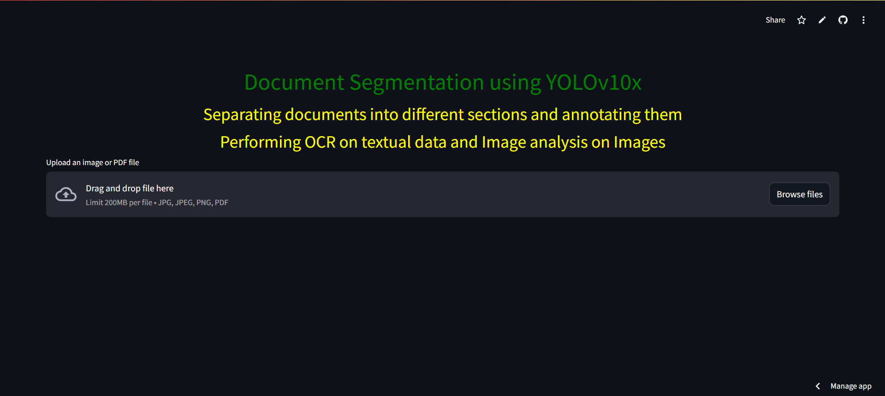
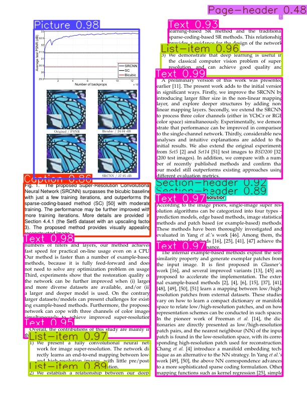
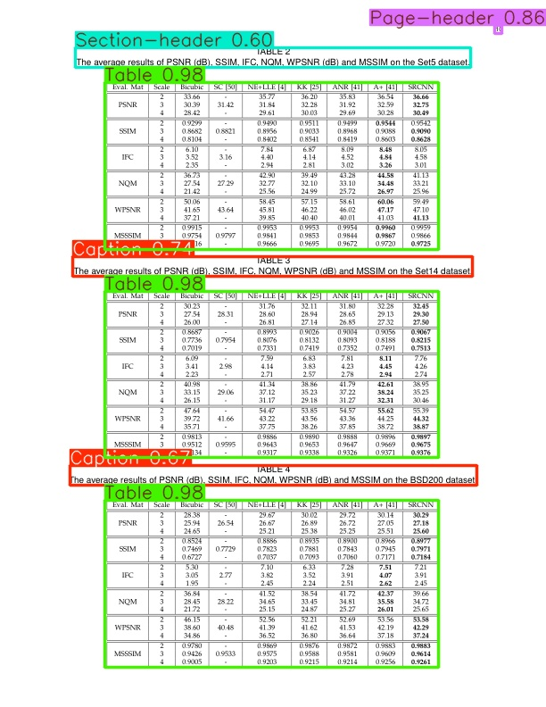
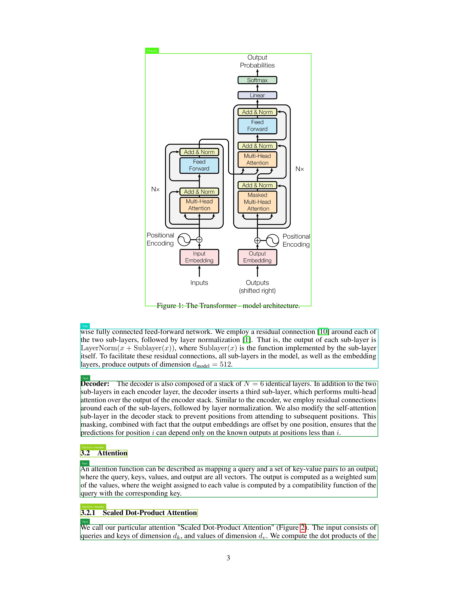
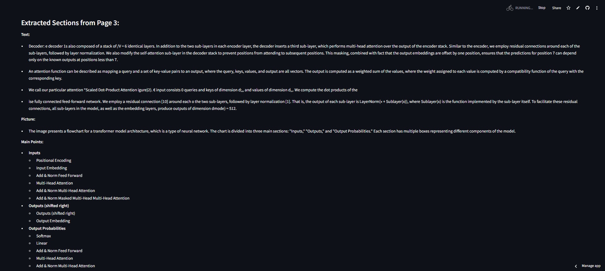

# YOLOv10 Document Segmentation Web-app

## Overview
A streamlit app for Document segmentation into different sections.
The web-app also performs OCR on the text-based annotated sections, and image-analysis on the image sections in each page of the document. 
OCR is performed on the text using the tesseract-ocr package.
For image analysis, we have used llama-3.2-11b-vision model. 

This app uses the YOLOv10x model for document segmentation to annotate various sections of a document such as text-fields, formulae, pictures, list-items,etc.
The model uses pretrained weights which may be dowloaded using this [colab notebook](Doc_analysis.ipynb).

[Link](https://yolodocsegmentation-es8sgqcljerv9ei2wgukq9.streamlit.app/) for deployed web-application using streamlit.

## Installation

1. **Clone the repository**
   
   ```bash
   git clone https://github.com/Cpt-Shaan/YOLO_DocSegmentation.git
   cd YOLO_DocSegmentation
2. **Install dependencies**
   ```bash
   pip install -r requirements.txt

## Use of API
The application makes use of a llama-3.2-11b-vison model, which provides its inference results for image analysis via an API by Groq. 

## Website Interface and Results


### Annotations on document



### Sample Document for text extraction and image analysis


### Text extracted and image analysis results being displayed on the website

